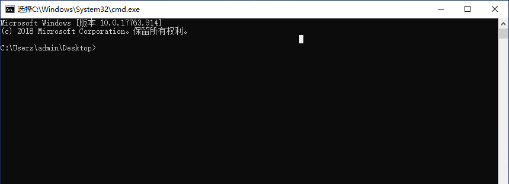
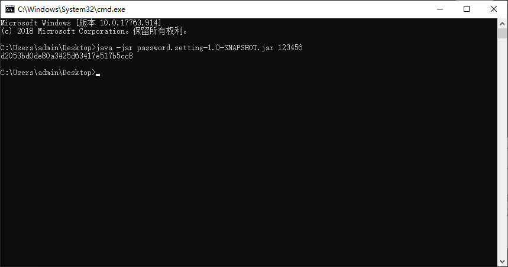
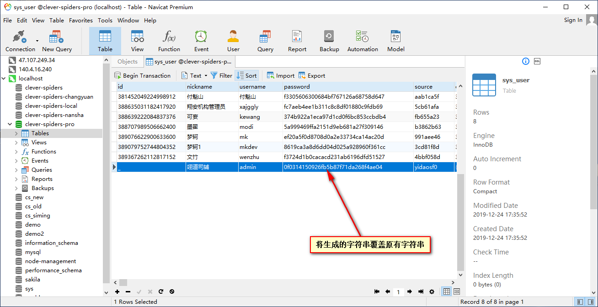

# <center>设置密码教程</center>

1. 需要安装jdk8
2. 打开cmd窗口，切换到jar包所在目录，如下图（下图jar包在桌面）
    
3. 输入如下命令（123456即为所需设置的密码）
    ```txt
    java -jar password.setting-1.0-SNAPSHOT.jar 123456
    ```
4. 结果如下图所示，所打印的即为123456加密后的字符串
    
5. 登录数据库找到sys_user表，并查找username为admin的记录，将第四步得到的字符串复制进password中
    