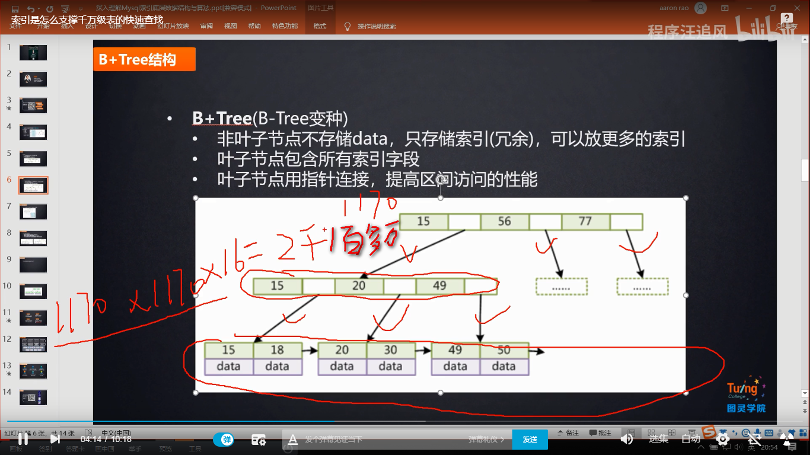

# Tree

## 二叉树(binary tree)

### 简述

+ 一个节点的==左边==分支比该节点的值要==小==
+ 一个节点的==右边==分支比该节点的值要==大==

## 红黑树

### 简述

+ 平衡二叉树
+ 随着节点的增加或减少，以==最小深度为导向（最小遍历次数）==，改变树的结构

## B-Tree

## B+Tree(B-Tree变种)

### 简述

+ 非叶子节点只存储索引（冗余），可以放更多的索引
+ 叶子节点包含所有索引字段
+ 叶子节点用指针连接，提高区间访问的性能
+ 深度等于3就能容纳2100多万数据

### 图示

