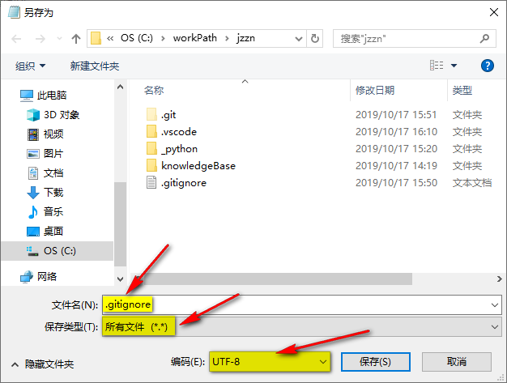

# 忽略提交

windows创建文件必须有文件名，没办法直接右键新建.gitignore文件，故创建方法如下

+ 创建.gitignore.txt文件
+ 编辑内容如下

    ```txt
    target
    vscode
    .gitignore
    *.idea/
    *.classpath
    *.project
    *.settings
    *.mdb
    *.ldb
    *.sln
    *.com
    *.class
    *.dll
    *.exe
    *.o
    *.so
    *.7z
    *.dmg
    *.gz
    *.iso
    *.jar
    *.rar
    *.iml
    *.ipr
    *.iws
    ```

+ 文件 -> 另存为
+ 如下图所示

    
