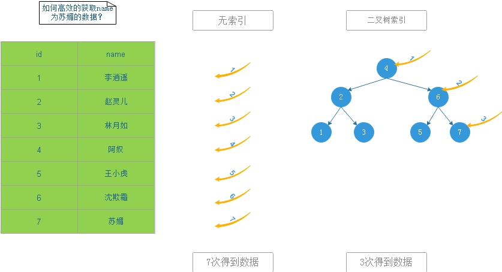

# INDEX

## 索引数据结构

1、**索引**是帮助MySql高效获取数据的==排好序==的==数据结构==

2、索引数据结构

+ 二叉树
  + 一个节点的==左边==分支比该节点的值要==小==，一个节点的==右边==分支比该节点的值要==大==
  + 缺点
    + 存在极端现象，退化为链表

    

+ 红黑树
  + 红黑树是二叉树的一种，规避了二叉树的缺点
  + 与平衡二叉树的区别（红黑树放弃完全平衡，每次插入最多旋转三次，平衡二叉树追求完全平衡，每次插入旋转次数不确定）
  + 随着节点的增加或减少，以==最小深度为导向（最小遍历次数）==，改变树的结构
  + 缺点
    + 大量数据时，查找效率低（二叉树的深度太高）
    
    

+ Hash表
+ B-Tree
  + 一个节点存储多条数据
  + 缺点
    + 大量重复数据，访问性能低下

    

+ B+Tree
  + 非叶子节点不存储数据，只存储索引（冗余，此处索引是索引字段值），可以放更多的索引
  + 叶子节点存储数据（包含多有的索引字段）
  + 叶子节点用指针链接，提高区间访问性能
  

3、数据库索引如何发挥作用

## Mysql索引

+ 采用B+Tree结构
+ 根数据加载到内存中
+ 每个节点大小为16k（show global status like 'Innodb_page_size';）
+ 区别==联合索引（联合索引）== 和 ==联合主键（复合主键）==
+ 为什么非主键索引结构叶子节点存储的是主键值？
    + 非主键索引即普通索引等，为了加快查询速度所人为增加的索引，innodb中这些索引的叶子点存储的是主键值
    + 一致性和节省存储空间