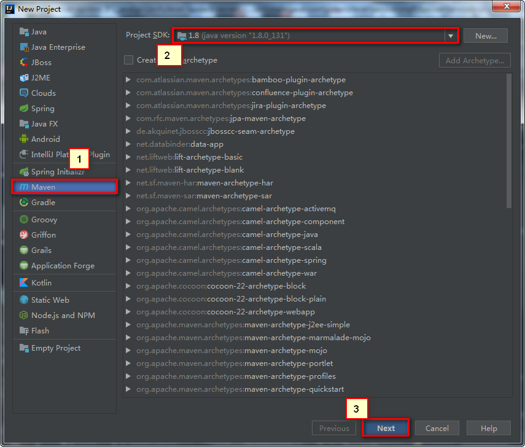
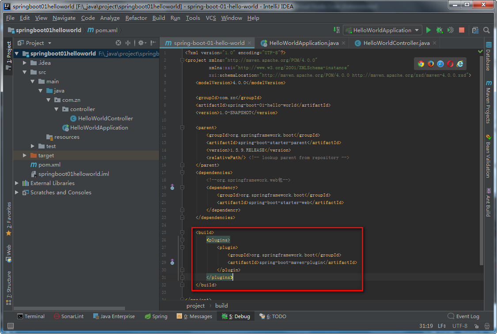

# helloWorld和部署

---

## 1、创建maven工程




## 2、导入springboot相关依赖

将下列配置粘贴到pom.xml文件中

```xml
<parent>
    <groupId>org.springframework.boot</groupId>
    <artifactId>spring-boot-starter-parent</artifactId>
    <version>1.5.9.RELEASE</version>
    <relativePath/> <!-- lookup parent from repository -->
</parent>
<dependencies>
    <!--org.springframework.web包-->
    <dependency>
        <groupId>org.springframework.boot</groupId>
        <artifactId>spring-boot-starter-web</artifactId>
    </dependency>
</dependencies>
```

pom.xml如下图所示


## 3、编写主程序（启动类）


## 4、编写controller


+ 1、控制层注解
+ 2、方法
+ 3、路径映射
+ 4、写给浏览器的注解

## 5、访问

[hellowWorld](http://localhost:8080/hello)

## 6、部署

将下列配置粘贴到pom.xml文件中，作用是将应用打包成可执行的jar包

```xml
<build>
    <plugins>
        <plugin>
            <groupId>org.springframework.boot</groupId>
            <artifactId>spring-boot-maven-plugin</artifactId>
        </plugin>
    </plugins>
</build>
```

pom.xml如下图所示



打包流程如下图所示


cmd窗口下，切换到jar包路径，java -jar ***.jar(cmd模式下tab可补全)
